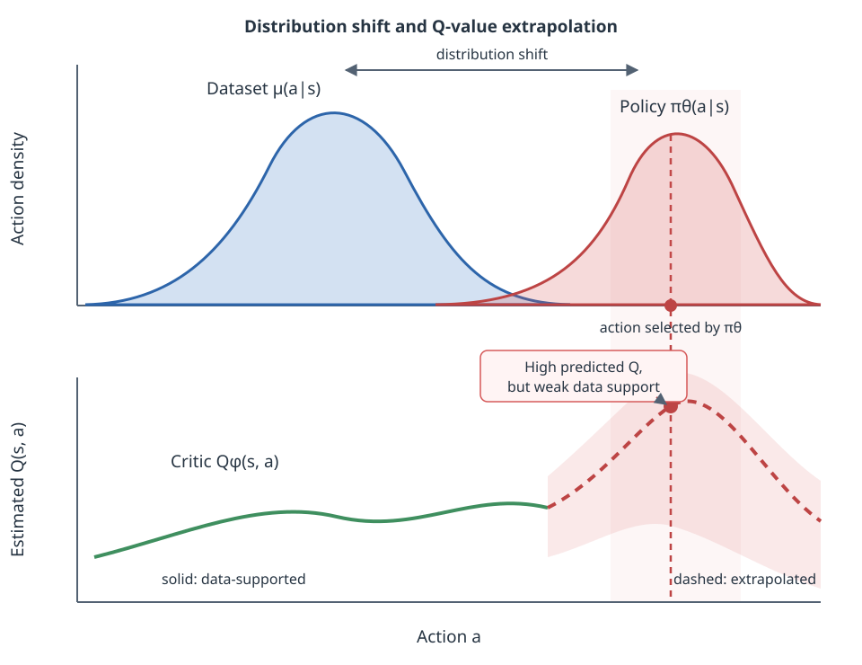

# Offline Reinforcement Learning

Offline reinforcement learning learns a policy from a fixed dataset. The agent
cannot collect new transitions while it trains. This restriction changes the
main problem: the learner must improve the policy without trying unsupported
actions in the environment.

This page assumes familiarity with
[off-policy learning](../policy-optimization/off-policy.md) and Q-functions.

## The offline setting

Let the fixed dataset be

$$
\mathcal{D} = \{(s_t, a_t, r_t, s_{t+1})\}_{t=1}^{N}.
$$

Here, $N$ is the number of transitions. A **behavior policy $\mu$** generated the actions in the dataset. The learner usually does not know $\mu$ directly. The data may also come from **several behavior policies**.

The goal is to learn a policy $\pi_\theta$ that maximizes its expected
discounted return,

$$
J(\pi_\theta) = \mathbb{E}_{\tau \sim \pi_\theta}
\left[\sum_{t=0}^{\infty} \gamma^t r_t\right],
$$

The expectation is over trajectories $\tau$ generated by the learned policy $\pi_\theta$. The agent must optimize this objective without adding any new transition to $\mathcal{D}$. **This creates distribution shift**: the state-action distribution induced by $\pi_\theta$ can differ from the distribution in the fixed dataset. The parameter $\theta$ represents the actor parameters, and $\gamma \in [0, 1)$ is the discount factor.

Offline RL differs from behavior cloning. Behavior cloning only learns to
predict dataset actions. Offline RL also uses rewards and transitions, so it
can prefer the better actions in a mixed-quality dataset.

## Why standard off-policy RL can fail

An online agent can try an action and observe its result. An offline agent
cannot. It must estimate the value of an action from the fixed data.

Suppose a learned policy selects an action that rarely appears in
$\mathcal{D}$. The critic has little evidence for that action, so its estimate
$Q(s, a)$ may be wrong. Such an action is out of distribution, or OOD, with
respect to the dataset.

The Bellman target makes this error dangerous:

$$
y = r + \gamma
\mathbb{E}_{a' \sim \pi(\cdot \mid s')}
\left[Q_{\bar{\phi}}(s', a')\right].
$$

The target uses the value of the next action $a'$. The parameters
$\bar{\phi}$ belong to a target critic. If $a'$ is OOD and its value is
overestimated, the target trains the current critic toward that overestimate.
The actor then prefers the same action because it appears valuable. Repeated
bootstrapping can amplify the original error.

This is the central offline RL failure mode:

1. The actor selects an action with weak dataset support.
2. The critic assigns that action an unreliable value.
3. Policy optimization favors an accidentally high estimate.
4. Bellman backups propagate the overestimate to earlier states.

Offline RL methods break this loop by limiting policy shift, learning
conservative values, or avoiding OOD actions during value learning.

## Start with behavior cloning

Behavior cloning, or BC, fits the dataset actions by supervised learning. For a
stochastic policy $\pi_\theta$ with actor parameters $\theta$, the loss is

$$
\mathcal{L}_{\mathrm{BC}}(\theta) =
-\mathbb{E}_{(s,a) \sim \mathcal{D}}
\left[\log \pi_\theta(a \mid s)\right].
$$

**BC is the first baseline to train.** It does not use the reward, but it avoids
most OOD actions. If a more complex method performs worse than BC, its value
estimates or policy updates are probably causing harm.

!!! warning "Dataset quality limits behavior cloning"

    The offline dataset may be suboptimal. BC imitates bad and good actions
    equally when the dataset contains both, so it inherits the quality of its
    data. As an imitation method, BC cannot be expected to reliably outperform
    the behavior policy or demonstrator that generated the data.

## Use rewards with filtered behavior cloning

If the dataset includes reward labels, a simple improvement is to imitate only
high-return trajectories. Assume the transitions in $\mathcal{D}$ are grouped
into a set of trajectories $\mathcal{T}$. The empirical return of a trajectory
$\tau$ is

$$
R(\tau) = \sum_{t=0}^{T_\tau-1} r(s_t, a_t),
$$

where $T_\tau$ is the length of $\tau$. Filtered behavior cloning has three
steps:

1. Rank the trajectories by $R(\tau)$.
2. Choose a threshold $\eta$ that keeps the top $k\%$ of trajectories.
3. Train BC only on the retained trajectories.

The filtered trajectory set is

$$
\widetilde{\mathcal{T}}
= \{\tau \in \mathcal{T} \mid R(\tau) \geq \eta\}.
$$

The policy objective becomes

$$
\max_\theta
\sum_{\tau \in \widetilde{\mathcal{T}}}
\sum_{(s,a) \in \tau}
\log \pi_\theta(a \mid s).
$$

Filtered BC is a primitive way to use reward information: it discards
low-return trajectories but otherwise performs ordinary imitation learning.
That simplicity makes it a strong baseline. A more complex offline RL method
should outperform filtered BC, not only unfiltered BC.

Filtering is coarse. A high-return trajectory can still contain bad actions,
and a low-return trajectory can contain useful actions. Keeping only the top
trajectories also reduces dataset coverage.

## Improve imitation with advantage weighting

Filtered BC assigns one score to a whole trajectory. A more precise approach
weights each transition according to whether its action is better than the
baseline action at the same state. The advantage function measures this:

$$
A^\pi(s,a) = Q^\pi(s,a) - V^\pi(s).
$$

A positive advantage means that action $a$ is better than the average action
under $\pi$ at state $s$. A negative advantage means that it is worse. Define
the imitation weight as

$$
w(s,a) = \exp\left(\frac{A^\pi(s,a)}{\lambda}\right),
$$

where the temperature $\lambda > 0$ controls how strongly the policy favors
high-advantage actions. The actor then solves a weighted BC objective:

$$
\max_\theta
\mathbb{E}_{(s,a) \sim \mathcal{D}}
\left[
w(s,a) \log \pi_\theta(a \mid s)
\right].
$$

This update still imitates actions from the dataset, but it gives more weight
to actions that the critic considers good. In practice, implementations often
clip or normalize the exponential weights so that a few transitions do not
dominate the update.

Detailed derivations and complete AWR, AWAC, and IQL walkthroughs are on
the [advantage estimation page](advantage-estimation.md).

### Connection to KL-constrained policy improvement

Advantage weighting can be derived from a policy improvement objective that
keeps the new policy close to the behavior policy $\mu$:

$$
\begin{aligned}
\pi_{\mathrm{new}}
= \arg\max_\pi\;&
\mathbb{E}_{a \sim \pi(\cdot \mid s)}
\left[Q^{\pi_k}(s,a)\right] \\
\text{subject to }\;&
D_{\mathrm{KL}}
\left(\pi(\cdot \mid s)\,\|\,\mu(\cdot \mid s)\right)
\leq \epsilon.
\end{aligned}
$$

The solution has the form

$$
\pi_{\mathrm{new}}(a \mid s)
= \frac{1}{Z(s)}
\mu(a \mid s)
\exp\left(\frac{A^{\pi_k}(s,a)}{\lambda}\right),
$$

where $Z(s)$ normalizes the action probabilities. Weighted BC projects this
non-parametric solution back into the parameterized policy $\pi_\theta$. This
connection is used by relative-entropy methods such as
[REPS](https://doi.org/10.1609/aaai.v24i1.7727).

The general approach is called **advantage-weighted imitation learning** or
**advantage-weighted regression**. AWR, AWAC, and IQL use similar weighted
actor objectives but obtain their advantage estimates in different ways.

!!! warning "Advantage weights depend on value accuracy"

    Weighted BC avoids training the actor on newly sampled OOD actions, but it
    still depends on estimated advantages. An inaccurate critic can assign a
    large weight to the wrong dataset action.

## Keep the policy near the data

Behavior-regularized methods optimize return while penalizing a policy that
moves too far from the behavior policy:

$$
\max_\pi
\mathbb{E}_{s \sim \mathcal{D},\,a \sim \pi}
[Q(s,a)]
- \alpha
\mathbb{E}_{s \sim \mathcal{D}}
[D(\pi(\cdot \mid s), \mu(\cdot \mid s))].
$$

The function $D$ measures the difference between two action distributions.
The coefficient $\alpha > 0$ controls the strength of the constraint. A small
$\alpha$ permits more policy improvement but more OOD actions. A large
$\alpha$ is safer but can reduce the method to behavior cloning.

TD3+BC uses a simple version of this idea for continuous actions. Its actor
maximizes

$$
\mathbb{E}_{(s,a) \sim \mathcal{D}}
\left[
\lambda Q_\phi(s, \pi_\theta(s))
- \|\pi_\theta(s) - a\|_2^2
\right].
$$

The first term improves the policy according to the critic. The second term
keeps the selected action close to the dataset action. The coefficient
$\lambda > 0$ balances the two terms.

## Learn conservative values

Conservative Q-Learning, or CQL, changes the critic instead of directly
constraining the actor. It lowers values for actions not supported by the data.

For discrete actions, a common conservative penalty is

$$
\mathcal{R}_{\mathrm{CQL}}(Q) =
\mathbb{E}_{s \sim \mathcal{D}}
\left[
\log \sum_a \exp Q(s,a)
- \mathbb{E}_{a \sim \mu(\cdot \mid s)}[Q(s,a)]
\right].
$$

The log-sum-exp term covers all actions. Minimizing it pushes their values
down. The second term offsets that pressure for dataset actions. The complete
critic objective adds this penalty to a Bellman error:

$$
\mathcal{L}_{Q} =
\mathcal{L}_{\mathrm{Bellman}}
+ \alpha \mathcal{R}_{\mathrm{CQL}}(Q).
$$

The coefficient $\alpha > 0$ controls how pessimistic the critic is. Too little
pessimism leaves OOD overestimation. Too much pessimism can hide real
differences between supported actions and prevent policy improvement.

## Avoid OOD actions in the value target

[Implicit Q-Learning (IQL)](https://arxiv.org/abs/2110.06169) learns an
upper-expectile value function from Q-values of dataset actions. It backs
$V_\psi(s')$ into the critic instead of sampling a next action, then extracts
the actor with advantage-weighted BC. Every Q-value in these updates is
evaluated at a dataset action, so IQL avoids querying the critic on OOD actions
during training.

The [advantage estimation for weighted imitation](advantage-estimation.md)
page covers:

1. the [weighted imitation objective](advantage-estimation.md#the-weighted-imitation-objective)
   and the role of the advantage weight;
2. [AWR with Monte Carlo advantages](advantage-estimation.md#monte-carlo-advantages-awr),
   including its full training walkthrough;
3. [AWAC with TD advantages](advantage-estimation.md#td-advantages-awac),
   including its critic and actor updates;
4. [IQL with in-sample advantages](advantage-estimation.md#in-sample-advantages-iql),
   including why it avoids OOD Q-queries;
5. the [expectile calculation](advantage-estimation.md#general-expectile-calculation),
   with a numerical example and an explanation of the expectile parameter
   $\tau$;
6. the [full IQL walkthrough](advantage-estimation.md#iql-walkthrough), from
   the value update to the target-critic update; and
7. [IDQL with diffusion policy extraction](advantage-estimation.md#diffusion-policy-extraction-idql),
   including diffusion behavior modeling, candidate scoring, and action
   selection; and
8. a [comparison of AWR, AWAC, IQL, and IDQL](advantage-estimation.md#compare-the-methods).

## Dataset coverage sets the limit

An offline method cannot determine the result of an action that the dataset
does not support. Algorithm choice does not remove this information limit.

Before training, inspect:

- the distribution and scale of rewards;
- the proportion of terminal transitions and time-limit truncations;
- the range of states and actions;
- the quality and diversity of trajectories;
- whether several behavior policies produced the data.

Time-limit truncation needs special care. A true terminal state has no future
reward. A transition cut off only because an episode reached a time limit may
still require bootstrapping. Treating both as terminal changes the learning
target.

## Evaluate without training on test interactions

If a simulator is available, the learned policy can be evaluated in separate
episodes. Those episodes must not enter the training dataset. This preserves
the offline training setting.

If no interaction is allowed, use off-policy evaluation, or OPE. Importance
sampling corrects for the difference between $\pi$ and $\mu$, but its variance
can grow quickly with trajectory length. Fitted Q Evaluation trains a separate
critic for the fixed target policy, but that critic can suffer from the same
coverage and approximation problems.

An OPE result should include uncertainty. It should not present one estimated
return as ground truth when the target policy has weak support in the data.

## A practical learning and implementation path

1. Train BC and record its evaluation return.
2. Verify reward scaling, observation normalization, action bounds, and
  terminal handling.
3. Train a simple offline baseline such as TD3+BC for continuous control.
4. Compare it with a conservative or implicit method such as CQL or IQL.
5. Track predicted Q-values as well as evaluation return. Rapidly increasing
  Q-values with flat returns indicate overestimation.
6. Run several random seeds and report both the mean and the variation.
7. Use OPE only with an explicit account of dataset coverage and uncertainty.

The main question is always the same: does the learned policy choose actions
whose consequences are supported by the fixed dataset?
